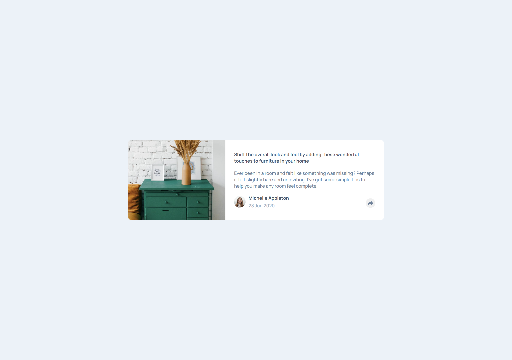
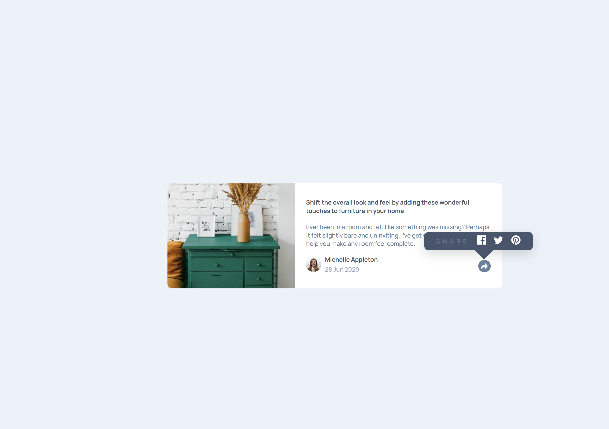
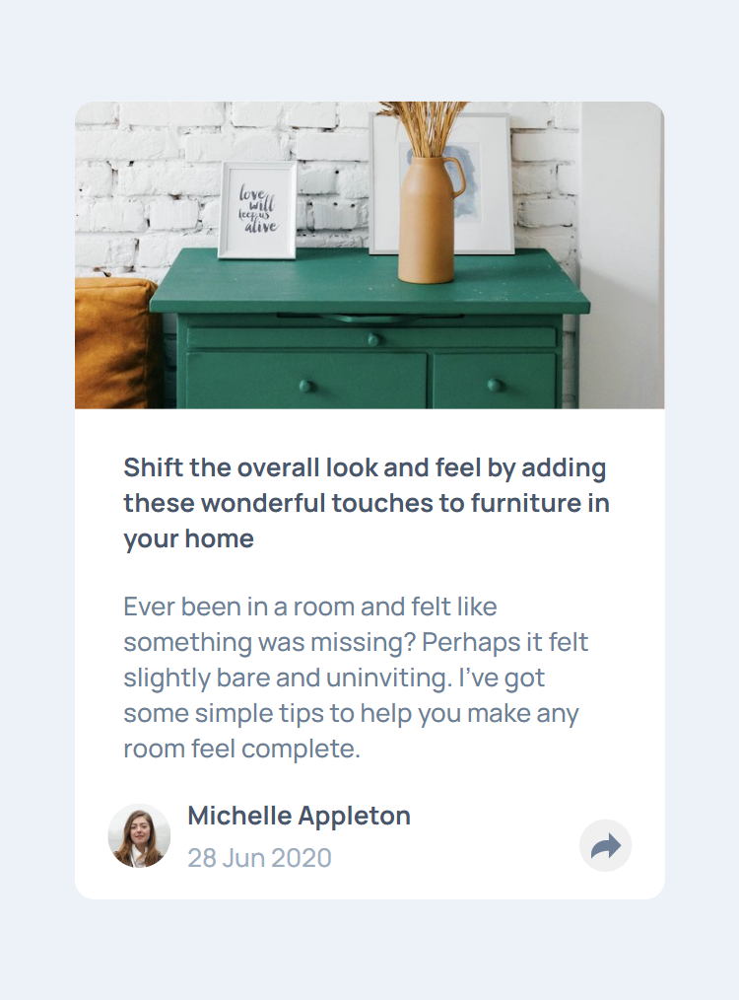
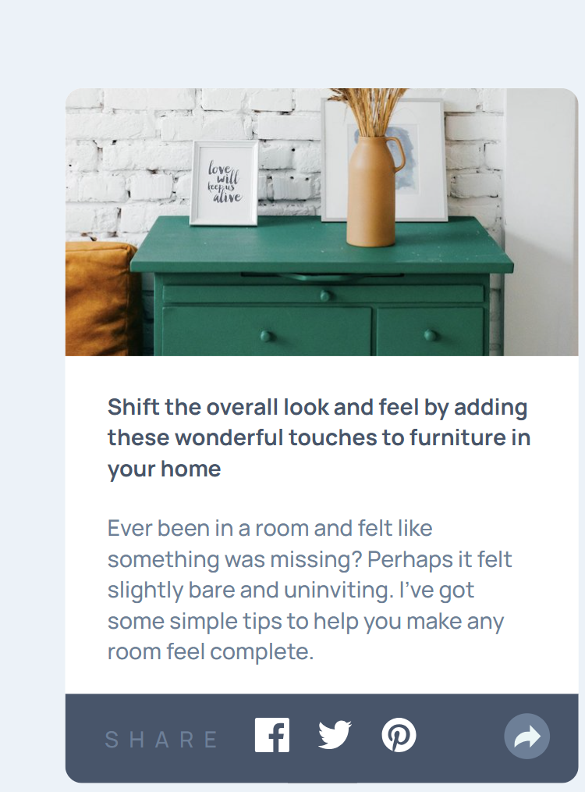

# Frontend Mentor - Article preview component solution

This is a solution to the [Article preview component challenge on Frontend Mentor](https://www.frontendmentor.io/challenges/article-preview-component-dYBN_pYFT). Frontend Mentor challenges help you improve your coding skills by building realistic projects.

## Table of contents

- [Overview](#overview)

  - [The challenge](#the-challenge)
  - [Screenshot](#screenshot)
  - [Links](#links)
  - [Built with](#built-with)
  - [What I learned](#what-i-learned)
  - [Continued development](#continued-development)
  - [Useful resources](#useful-resources)

## Overview

This project is an article preview component built as part of a Frontend Mentor challenge. The goal is to recreate a visually appealing article preview component that showcases a article preview, including its image, info of article, info of author, and the social icons. The component adapts seamlessly to different screen sizes, ensuring a consistent user experience on both desktop and mobile devices. The implementation emphasizes semantic HTML, modern CSS (including custom properties and Sass), and the only JavaScript being to initiate the share options when someone clicks the share icon.

### The challenge

Users should be able to:

- View the optimal layout for the component depending on their device's screen size
- See the social media share links when they click the share icon

### Screenshot






### Links

- Solution URL: [Add solution URL here](https://github.com/remainhumble/Article-preview-component)
- Live Site URL: [Add live site URL here](https://remainhumble.github.io/Article-preview-component/)

### Built with

- Semantic HTML5 markup
- CSS custom properties
- Flexbox
- JavaScript
- Mobile-first workflow

### What I learned

While working on this project, I deepened my understanding of responsive design and semantic HTML. I learned how to use CSS custom properties to maintain consistent theming and how to leverage Flexbox for flexible layouts. Implementing the share functionality with minimal JavaScript helped me practice event handling and DOM manipulation.

One area I found particularly interesting was toggling the visibility of the share options. Here’s a snippet of how I handled the share button click:

```js
const shareBtn = document.querySelector(".share-btn");
const shareOptions = document.querySelector(".share-options");

shareBtn.addEventListener("click", () => {
  shareOptions.classList.toggle("active");
});
```

Overall, this project reinforced the importance of clean, maintainable code and thoughtful UI/UX design.

### Continued development

In future projects, I want to continue focusing on:

- Improving my proficiency with advanced CSS techniques, such as CSS Grid and transitions, to create more dynamic layouts and interactions.
- Deepening my understanding of accessibility best practices to ensure my components are usable by everyone.
- Refining my JavaScript skills, especially around event handling and state management for interactive UI elements.
- Exploring more efficient ways to structure and organize my code for scalability and maintainability.
- Practicing writing more comprehensive tests for UI components to catch edge cases and ensure reliability.
- Experimenting with CSS preprocessors like Sass to streamline my styling workflow and maintain cleaner codebases.
- Enhancing my workflow with build tools and automation for faster development and deployment.
- Continuing to learn about performance optimization techniques for faster load times and smoother user experiences.

### Useful resources

- [Handling user events](https://www.frontendmentor.io/learning-paths/javascript-fundamentals-oR7g6-mTZ-/steps/684feaab52709e9eee0f7fb4/article/read) - Important concepts surrounding events, and looking at the fundamentals of how they work in browsers.
- [Bro Code](https://www.youtube.com/@BroCodez) - Coding bootcamps HATE him! See how he can teach you to code with this one weird trick. His channel is dedicated to providing free education to those that can't afford college, bootcamps, and overpriced crap coding gurus trying to sell you.

## Author

- Frontend Mentor - [@remainhumble](https://www.frontendmentor.io/profile/remainhumble)
- X(formerly Twitter) - [@thiflan120699](https://x.com/thiflan120699)
